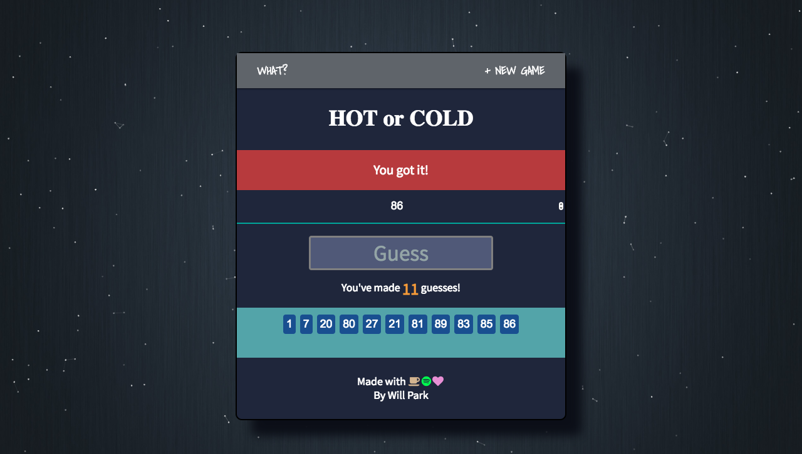
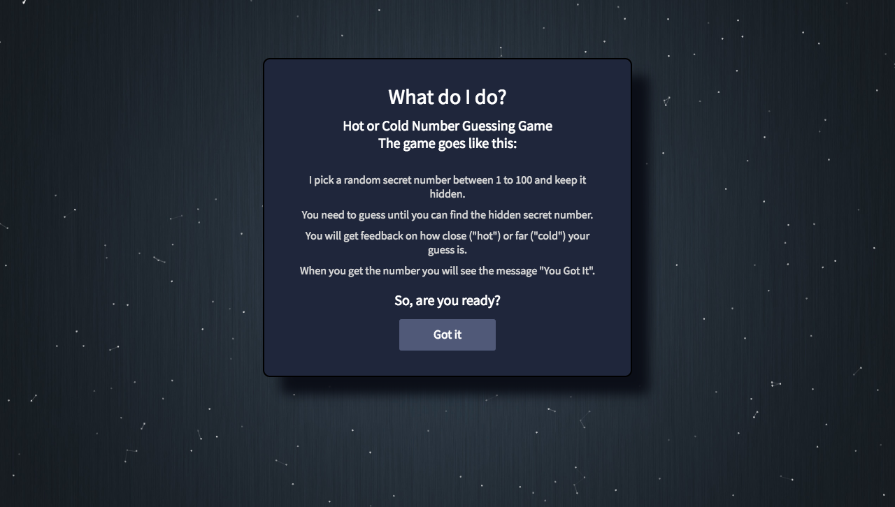

# Hot N Cold
  Built with React and Redux, Hot or Cold is an interactive game that allows users to attempt to guess a randomly generated number.

## Introduction
  Hot N Cold is an interactive and simple number guessing game. The app allows users to attempt to guess a randomly generated number with cold or hot hints throughout the game. Users can play this simple game with friends and use it for fun scenarios like picking a person to wash dishes or go run errands. Check out the game and guess the number!

## Live Demo
  You can find the live demo of Hot N Cold at:  
  https://hotcold.netlify.com

## Screenshots
Home Display Page

Instructions

## Technology

<li> React  
<li> Redux  
<li> HTML5  
<li> CSS3  
<li> JavaScript  
<li> Enzyme  
<li> Jest  
<li> Netlify  

## Authors/Contributors
<li> William Park - (https://github.com/wjypark94)